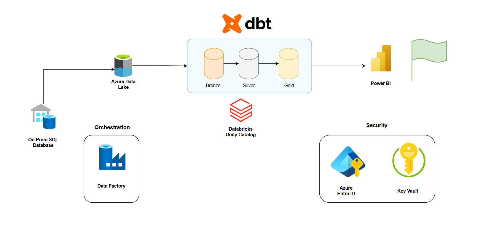
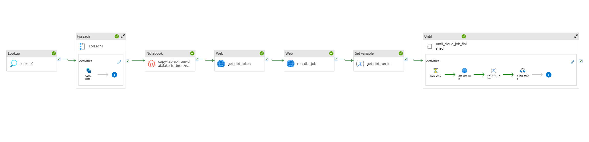
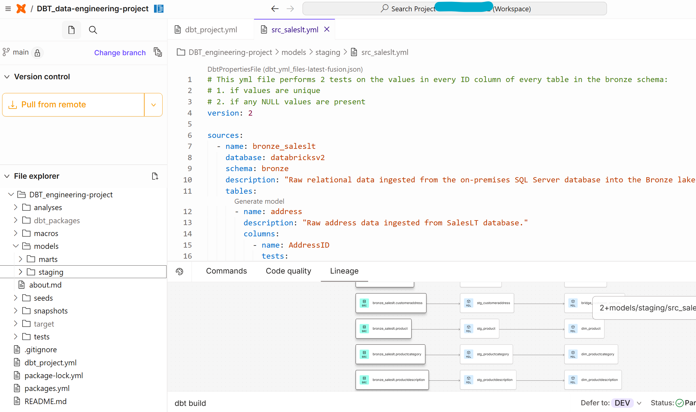
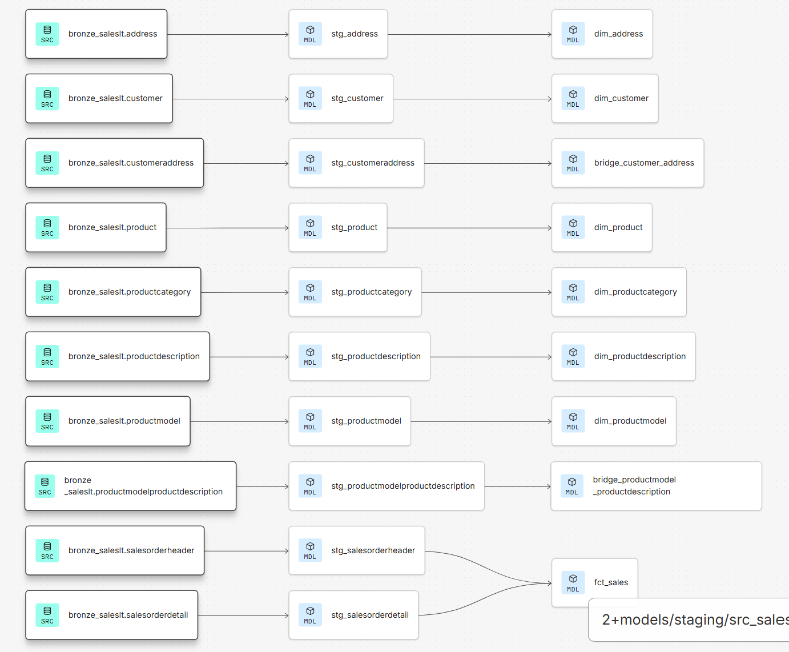
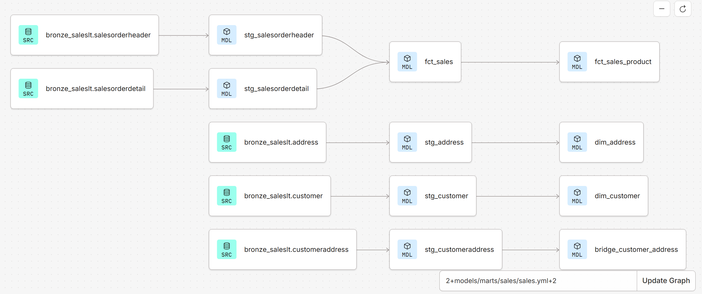
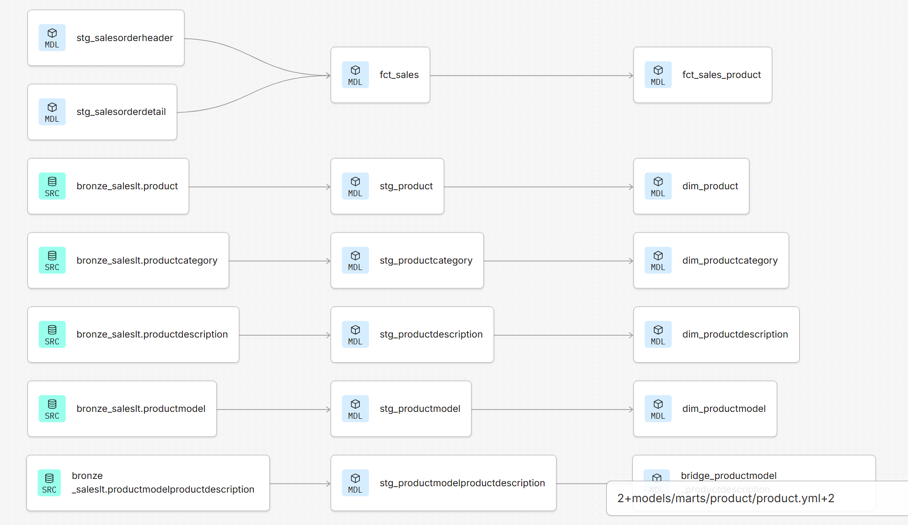

# DBT Data Engineering Project

## 🟨To do (DELETE when done)
- make dashboards in Power BI
- Link to dashboard images
- Copy all links again with forward slashes now setting is toggled for that

## Introduction
In this DBT data engineering pipeline project, I set out to build and automate a data pipeline moving data from an onPrem SQL server to Databricks Unity Catalog. Then, by using **DBT Cloud** on Medallion Architecture, perform transformations and create two data marts: Sales and Product. At the end of the pipeline, the resultant data marts were analysed via Power BI. The pipeline was automated to run daily.

**Key Points of Note are below**:

- I used DBT cloud as opposed to DBT Core. This was because in enterprise environments, DBT Cloud is the preferred tool due to its GUI and ease of use.

- In DBT Cloud, I recreated an enterprise workflow with creation of Staging models and Data Marts for different business stakeholders.

- In Data Factory, I used best practices of enterprise security and governance in the form of storing secrets in Azure Keyvault and using Azure Entra ID.

- I also used a maintainable workflow in the form of pipeline parameters for values such as DBT account ID and Job ID.

- The pipeline was one of ELT as opposed to ETL as the data was loaded into Databricks Unity Catalog first before being transformed with DBT.

- I performed the pipeline orchestration using Azure Data Factory.

- To recreate an enterprise environment, I used Microsoft Hyper-V to create an isolated virtual machine to house the entire project.

- I used the public Microsoft dataset named 'Adventure Works 2025'. This is a public fictional dataset which represents enterprise sales data of a sports retailer called Adventure Works.

The full data pipeline diagram can be seen below:

The Azure Data Factory pipeline can also be seen below:

My DBT Cloud workspace can be seen below:

## Tools I used
- **DBT Cloud** - to perform modular transformations and build Sales and Product data marts using models and macros which were then loaded back into Databricks Unity Catalog.

- **Databricks** - the platform to load the data into Unity Catalog in the ELT process.

- **Azure Data Factory** - to orchestrate the ELT pipeline

- **Azure Data Lake** - to act as a bridge between Microsoft SQL Server and Databricks Unity Catalog.

- **Azure Entra ID fka Active Directory** - to securely store DBT and Databricks API tokens and programmatically use these in the pipeline for best practice in security and governance.

- **Microsoft SQL Server** - the source on-Prem SQL database management system that initially held the data.

- **Microsoft Power BI** - to visually analyse the data from Azure Synapse Analytics using Star Schema method

- **Microsoft Hyper-V** - to recreate an enterprise environment by creating an isolated virtual machine to house the project.

## Brief Explanation of Pipeline
For reference, the full data pipeline diagram can be seen below:

The Azure Data Factory pipeline can also be seen below:

The pipeline ingested data from an on-prem SQL database into Azure Data Lake. Then, via a SQL script it was loaded into Databricks Unity Catalog in a Bronze container. Then, via a web activity a DBT access token was retrieved from Azure Keyvault. Next, by accessing the DBT API the DBT transformation and data marts job was run via a second web activity.  

**Details on my DBT activities will come up in an upcoming section titled [DBT Walkthrough](#DBT-walkthrough).** 

The DBT transformation and data marts job was performed on the data in the Databricks Bronze container.  

Lastly, an Until activity, alongside further nested activities, were used to poll the DBT API every 20 seconds to check if the DBT transformation and data marts job was complete. This returned either a success or fail message.  
On fail, the pipeline stopped running.  
On success, the transformed data was loaded into a Silver container in Databricks Unity Catalog and the two data marts were loaded into their respective Gold containers. This allowed easy access for different business stakeholders.

Lastly, I connected Power BI to the two datamarts in Databricks Unity Catalog via a pbids file and analysed the data to produce two business-ready dashboards.

## Detailed Explanation of Pipeline
For reference, the full data pipeline diagram can be seen below:

The Azure Data Factory pipeline can also be seen below:

1. **Ingestion**:
   * Azure Data Factory ingests data from SQL Server using a Lookup activity.
   * Using a ForEach activity, data is extracted raw and converted to Parquet files into Data Lake.

2. **Extraction and Load**:
   - Using SQL scripts in Databricks, the data is then loaded into a Bronze container in Databricks Unity Catalog. 
   - **SQL scripts can be accessed** [here](assets/code-snippets/create-bronze-tables-into-unity-catalog.ipynb) 
   - Using SQL scripts over Python scripts is highly efficient as SQL uses the Databricks backend C++ engine and is more optimised for Data ingestion tasks.

3. **Transformation**:
   - Using a Web activity, a DBT token is retrieved from Azure Key Vault by an API call.
   - Using a second Web activity, the DBT transformation job is initiated by an API call. This uses the Token from the previous step. **The DBT build, transformations performed and resultant data marts will be discussed in the DBT walkthrough section.** Click [here](#DBT-walkthrough) to go straight there.
   - Using a Set Variable activity, the DBT run ID (taken from the output of the previous activity) is stored inside the pipeline variable *dbt_run_id*.
 
4. **Polling DBT API and Pipeline end**:
   - Using an Until activity, there are 4 nested activities:
     1. A Wait activity waits for 20 seconds to avoid API throttling.
     2. A second Web activity (get_dbt_run) retrieves the DBT run ID and polls the DBT API checking if the DBT job was successful or failed.
     3.  A Set Variable activity is used to set the pipeline variable *job_status* with some conditional logic. The logic is where if the output of get_dbt_run (the previous step) is 10, it sets the job_status variable as the string 'false', otherwise it sets it as the string 'true'.  
     Why 10? 10 is the job status value returned by the DBT API indicating a successful job. If it returns a success, the pipeline successfully stops. If it returns true, then it initiates the next activity which handles the logic if the DBT job fails.
     4. An If activity which outlines the pipeline logic if the job is failed. This contains 2 nested activities:
        -  A set variable activity which checks the JSON output of the activity get_dbt_run.data.in_progress whether it is true or false. It then sets the dbt_job_status pipeline variable as this value as a string format.
        -  A fail activity which stops the pipeline completely and returns an error message.
   -  On success of the pipeline, DBT builds staging models into a Silver container in Databricks Unity Catalog. It also builds production models in the form of two data marts: Sales and Product. Both these data marts are built in their respective Gold containers in Databricks unity catalog.
  
5. **Business Data Analysis**:

   - Lastly, the data marts in Databricks Unity Catalog are connected to Power BI using the in-built Power BI connection file (.pbids) within Databricks. This allows on-demand analysis and the creation of dashboards Sales and Product.

## DBT-walkthrough
This section walks you through what work I did in DBT. I used DBT cloud as opposed to DBT Core. This was because in enterprise environments, DBT Cloud is the preferred tool due to its GUI and ease of use.

1. **Setting up development workspace and environment**
   - I set up DBT to connect with Databricks using an access token. I also set up a dev environment in DBT and connected it to a Github repository. That is the Github repository that houses this project.
   - I also initialised the dbt-project.yml file for project configurations.
   Workspace screenshot can be seen below:
   

2. **Staging Model Creation (Bronze to Silver layer)**
   - I initialised the staging yml file (src_saleslt.yml) for staging model configurations. This defined the staging models and performed null and unique tests on the tables ingested from Databricks.
   - I then created the staging sql files applying 2 transformations with a macro and using column logic using DBT jinja. The transformations included:
     -  formatting the all date columns to remove hours, minutes, seconds. Jinja logic was also used to loop through each column in every table to assess if it was a date column. 
     -  add a timestamp column showing when dbt processed this change. 
     -  reducing numeric currency column values to two decimal points.  
   **The YML and SQL files can be accessed [here](models/staging)**  
   **The Macro file can be accessed here**  
   The resultant DAG can be seen below:
   

3. **Sales Data Mart Creation (Silver to Gold layer 1)**
   - I initialised the Sales Data Mart yml file (sales.yml) for the data mart model configurations. This defined the models for this data mart, performed null and unique tests on the tables and defined relationships between dimension tables, bridge table and fact table.
   - I then created sales mart sql files for the fact tables and dimension tables.  
   **The YML and SQL files can be accessed [here](models/marts/sales)**  
   The resultant DAG can be seen below:
   

4. **Product Data Mart Creation (Silver to Gold layer 2)**
   - I initialised the Product Data Mart yml file (product.yml) for the data mart model configurations. This defined the models for this data mart, performed null and unique tests on the tables and defined relationships between dimension tables, bridge table and fact table.
   - I then created sales mart sql files for the fact tables and dimension tables.  
   **The YML and SQL files can be accessed [here](models/marts/product)**  
   The resultant DAG can be seen below:
   

## Conclusion

## Notes:

Staging folder contains data cleansing activity bronze --> silver

- creation of macro
- setting up project yml
- creation of staging sql files
  - data cleansing all column headers (using Jinja)
  - in Product model, transforms decimal numbers to two decimal points for the columns containing float numbers

## mart folder silver --> gold

### sales mart

- creating fct_sales table by inner joining stg_salesorderheader and stg_salesorderdetail models
- creating address and customer dimension tables
- creating customer and address bridge table to solve many-to-many relationship between address and customer dimension tables
- adding sales mart schema in dbt_project.yml file

### product mart

- creating dimension tables: product, product category, product description, product model
- creating product model and product description bridge table to solve many-to-many relationship between product model and product description dimension tables
- configuring dimension tables, bridge tables and their relationships in the product.yml file
- adding product mart schema in dbt_project.yml file

- creating dbt docs

### Automation

---

Welcome to your new dbt project!

### Using the starter project

Try running the following commands:

- dbt run
- dbt test

### Resources:

- Learn more about dbt [in the docs](https://docs.getdbt.com/docs/introduction)
- Check out [Discourse](https://discourse.getdbt.com/) for commonly asked questions and answers
- Join the [dbt community](https://getdbt.com/community) to learn from other analytics engineers
- Find [dbt events](https://events.getdbt.com) near you
- Check out [the blog](https://blog.getdbt.com/) for the latest news on dbt's development and best practices
